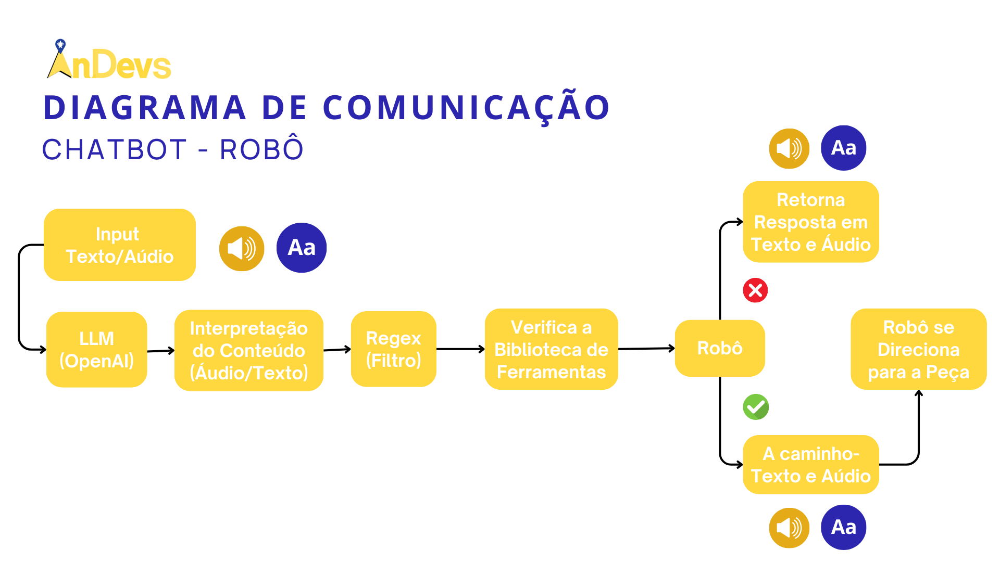

# Interações com LLM por Áudio 

## Speech to Text 

Este pacote foi desenvolvido para implementar a funcionalidade de Speech to Text (STT) em um ambiente ROS 2, utilizando a API do OpenAI. Ele possibilita a transcrição de áudio em texto, facilitando a interação com sistemas baseados em voz. A capacidade de interpretar comandos de voz e convertê-los em mensagens compreensíveis pelo sistema torna este pacote uma ferramenta valiosa para aplicações de voz em robótica.

## Text to Speech

Este pacote foi projetado para implementar a funcionalidade de Text to Speech (TTS) em um ambiente ROS 2, utilizando a API do OpenAI. Ele permite a conversão de mensagens de texto em fala, proporcionando uma interação auditiva com o sistema. As respostas geradas de forma natural pela API do OpenAI são reproduzidas em áudio, enriquecendo a experiência do usuário.

## Fluxo de Funcionamento: 

 

## Como Usar

1. **Clonar o Repositório do Projeto:** 
    ```bash
    git clone https://github.com/2023M8T2-Inteli/andevs.git
    ```

2. **Acessar a Pasta que Contém o Sistema de STT/TTS:** 
    ```bash
    cd /src/STT
    ```

3. **Executar o Comando a Seguir:** 
    ```bash
    python3 stt.py
    ```

    Isso iniciará uma interface com o Gradio, acessível através da rota: [http://127.0.0.1:7860/](http://127.0.0.1:7860/). Nessa interface, é possível gravar áudio via microfone, e esse áudio interage com o modelo por meio de um contexto, proporcionando informações sobre o sistema, conforme apresentado na demonstração.

## Requisitos

Para executar o sistema, as seguintes bibliotecas precisam ser instaladas:

- `pyttsx3`
- `gradio`
- `openai`

Além disso, é necessário possuir uma chave de acesso para utilizar a API da OpenAI. Para obter essa chave, siga o tutorial a seguir: [Tutorial para Obter Chave de Acesso à API da OpenAI](https://medium.com/data-professor/beginners-guide-to-openai-api-a0420bc58ee5#:~:text=Getting%20your%20own%20OpenAI%20API%20key&text=Click%20on%20Menu%20%3E%20Developers%20%3E%20Overview,API%20key%20for%20future%20reference).

## Demonstração

<iframe width="900" height="450" src="https://www.youtube.com/embed/RStEpCzI9SE?si=Z4XIj7lPxOYCBeqE" title="YouTube video player" frameborder="0" allow="accelerometer; autoplay; clipboard-write; encrypted-media; gyroscope; picture-in-picture; web-share" allowfullscreen></iframe>