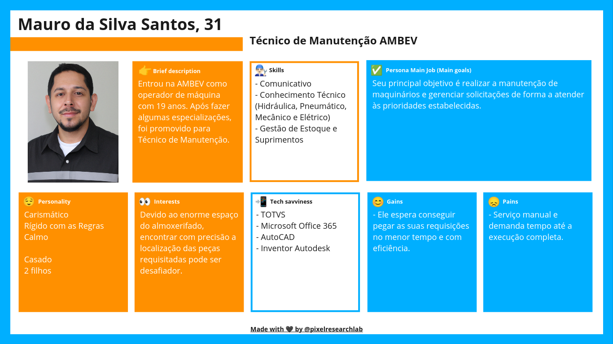
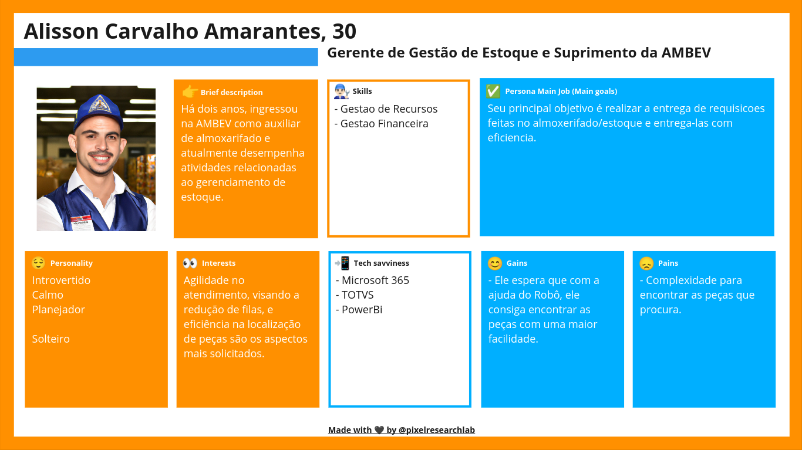

# Personas e User Stories

## User Stories - Técnico de Manutenção
1. Como Técnico de manutenção, eu gostaria de poder fazer solicitações de peças e materiais de manutenção de forma rápida e eficiente, para minimizar o tempo de espera e manter as operações em funcionamento sem problemas.
2. Como Técnico de manutenção, eu adoraria ter a capacidade de localizar facilmente as peças e materiais no almoxarifado, talvez com um sistema de mapeamento ou orientação, para economizar tempo e evitar erros de localização.
3. Eu gostaria de receber notificações ou alertas quando as peças que solicitei estiverem prontas para retirada, para que eu não precise ficar constantemente verificando o status.
4. Eu gostaria de uma opção de comunicação fácil com o pessoal do almoxarifado para esclarecer dúvidas ou detalhes sobre minhas solicitações.
5. Como Mauro, gostaria de poder acessar informações e recursos técnicos relevantes, como manuais de manutenção, especificações técnicas e documentação de peças, diretamente do sistema para me ajudar nas minhas tarefas de manutenção.
6. Eu adoraria ter a opção de fornecer feedback sobre o processo de solicitação e retirada de peças, para que possam ser feitas melhorias contínuas no sistema

## User Stories - Gerente de Gestão de Estoque e Suprimento
1. Como Gerente de Gestão de Estoque e Suprimento, desejo utilizar o robô de autoatendimento do almoxarifado para agilizar a localização de peças e, assim, reduzir o tempo necessário para atender às requisições dos técnicos de manutenção. Isso me permitirá entregar as peças com maior eficiência e reduzir filas de espera no almoxarifado.
2. Como Gerente de Gestão de Estoque e Suprimento, espero que o robô me auxilie na gestão dos recursos do almoxarifado, possibilitando um controle mais eficiente do estoque e uma melhor distribuição de peças. Isso contribuirá para otimizar os recursos financeiros da empresa e evitar desperdícios.
3. Como Gerente de Gestão de Estoque e Suprimento, quero que o robô de autoatendimento seja fácil de usar e forneça informações claras e precisas sobre a localização das peças no almoxarifado. Isso me ajudará a evitar erros na entrega das peças e a manter um ambiente de trabalho organizado e eficiente.
4. Como Gerente de Gestão de Estoque e Suprimento, desejo que o robô esteja integrado com as ferramentas que utilizamos no dia a dia, como Microsoft 365 e TOTVS, para que eu possa acompanhar o desempenho do almoxarifado por meio de relatórios no PowerBi. Isso me permitirá tomar decisões mais informadas e estratégicas em relação ao estoque e suprimento da empresa.