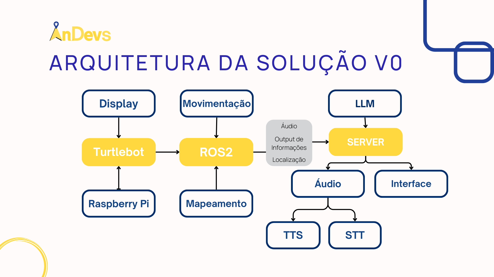
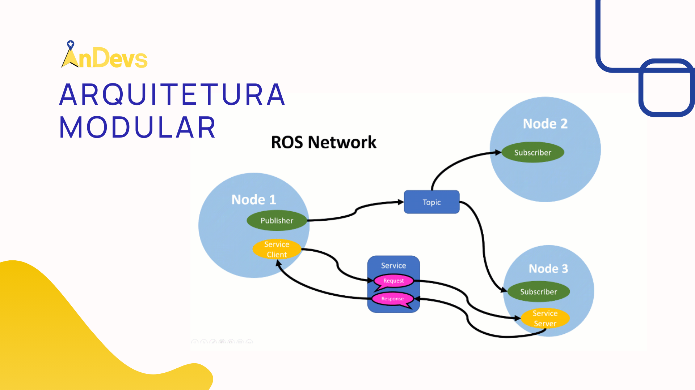
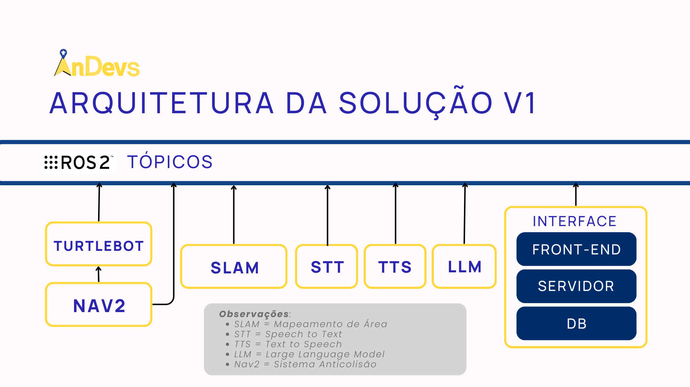
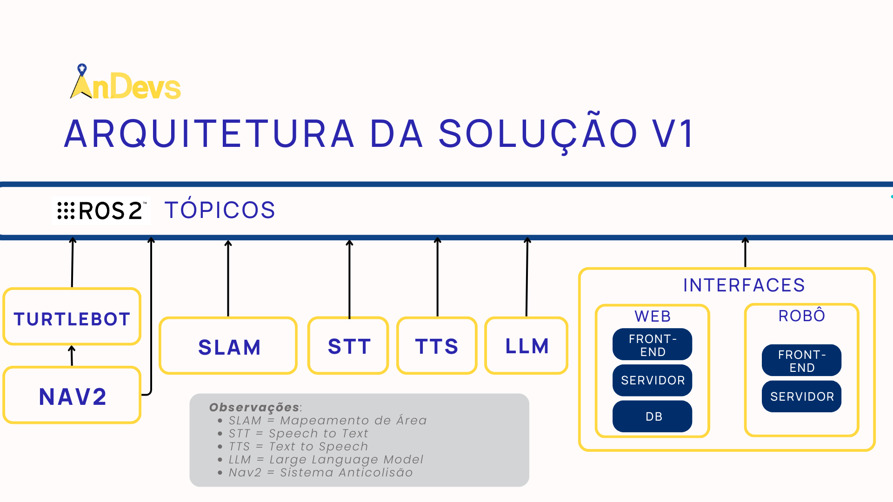

# Arquitetura do Sistema

### Versão Inicial 
Inicialmente pensando no comum de desenvolvimento inicial de arquiteturas foi feito um planejamento de uma arquitetura utilizando 3 blocos principais: 
1. Servidor 
2. Turtlebot 
3. ROS2 

Assim como demonstrado no diagrama abaixo. 

### Arquitetura Modular 
Após uma primeira validação da arquitetura entendemos que existe uma vantagem em trabalhar no sistema de comunicação por meio do ROS2. Em que temos uma comunicação comum para todas as frentes do projeto e podemos trabalhar com cada um dos blocos de forma modular, com o sistema de interação com tópicos, como demonstrado na imagem abaixo: 

Com base nisso criamos uma segunda versão para a arquitetura que tem sua estrutura baseada em diferentes módulos todos atuando como sistemas individuais que se comunicam por meio de uma mesma fonte, que é o ROS2. Como demonstrado na imagem abaixo: 

Assim, trabalhamos com uma arquitetura em modulos que pode apresentar algumas vantagens, como: 
- A cada Sprint conseguimos entregar um módulo completo 
- Inclusão futura de novos módulos/funcionalidades no sistema.

### Arquitetura V1.1

Na segunda Sprint, observamos que tópico de interface teve uma atualização de arquitetura, sendo ela a seguinte:

- A divisão de duas interfaces, uma para o usuário e outra para o robô, sendo que a interface do usuário é responsável por receber os comandos de voz ou de texto, e a interface do robô é responsável por receber os resultados da pesquisa e mostrar o status do progresso de busca da peça.

