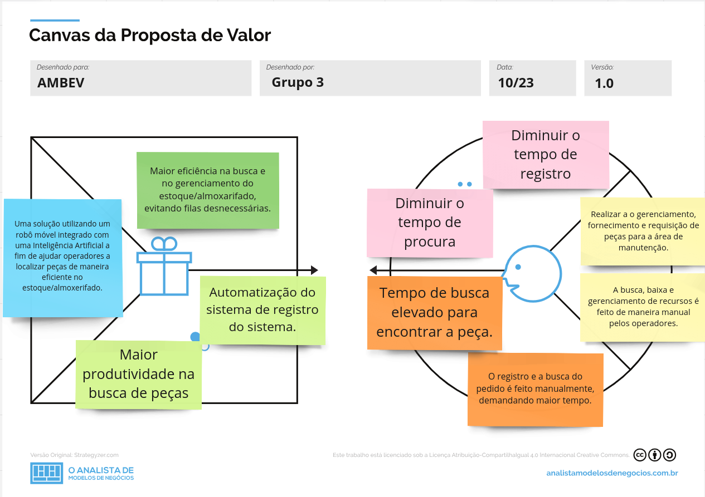

# Canvas Proposta de Valor

# Explicação
Mediante ao que foi apresentado no TAPI, um documento referente ao objetivo do projeto, qual é a problemátcia apresentada e qual é a solução proposta, foi elaborado o Canvas Proposta de Valor, que é um documento que tem como objetivo apresentar a proposta de valor do projeto, ou seja, o que o projeto irá oferecer para o cliente, qual é o valor que o projeto irá agregar para o cliente.
Na entrevista com o parceiro, foi apresentado que algumas das problemáticas estão relacionadas com a falta de eficiência no processo de busca de peças em um estoque ou almoxarifado, assim como na baixa das informações associadas. Após uma análise minunciosa, uma solução encontrada foi a adaptação de um robô móvel para que ele possa realizar a busca das peças no estoque, auxiliando o gestor da área. Isso ocorre porque sua base de dados já estará atualizada com as localizações, o que permite agilizar o processo de busca das peças. A proposta de valor do projeto consiste na agilidade do processo de busca de peças e na redução de custos com mão de obra, uma vez que o robô executará o processo de busca das peças e enviará ao sistema a informação de que uma peça foi requisitada, ficando a critério do gestor da área decidir se a mesma pode ser baixada ou não.

Com essa solução, visa atender os requisitos da problemática apresentada no Canvas, sendo eles:

* Diminuir o tempo de busca de peças no estoque;
* Diminuir o tempo de registro;