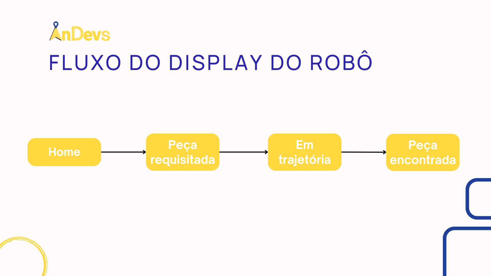
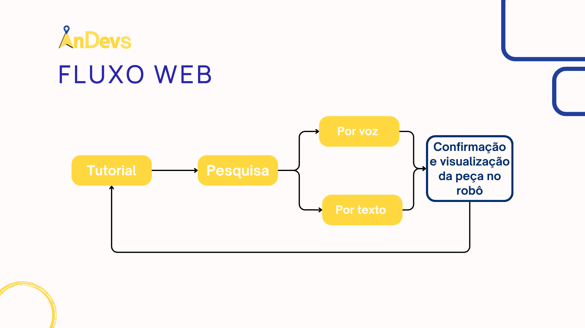

# Arquitetura de Interfaces

## Introdução

Nossa solução possui duas interfaces, uma diretamente para o usuário que é a interface Web Mobile, voltada para requisições utilizando interpretação de voz ou texto, e a segunda para o Robô, na qual seu objetivo é mostrar os status, tanto de progresso de busca da paç quanto de disponibilidade do robô, seja bateria ou conexão com o servidor.

Seguindo essa lógica, as arquiteturas foram pensadas na seguinte forma:

## Fluxo das telas do Robô

## Fluxo das telas do Web Mobile

## Wireframe do Robô

Logo abaixo, temos o fluxo de funcionamento da interface do robô, que é responsável por mostrar o status do robô, seja de bateria ou de conexão com o servidor, e também mostrar o status de progresso de busca da peça.

<iframe style={{ display: 'block', margin: 'auto', width: '100%', height: '50vh', }} src="https://slides.com/kilteixeira/deck/fullscreen" frameborder="0" allowFullScreen> </iframe>

## Wireframe do Web Mobile

Logo abaixo, temos o fluxo de funcionamento da interface do Web Mobile, que é responsável por receber os comandos de voz ou de texto, e enviar para o servidor, que por sua vez, irá enviar para o robô.

<iframe style={{ display: 'block', margin: 'auto', width: '23%', height: '50vh', }} src="https://slides.com/kilteixeira/deck-c6a24b/fullscreen" frameborder="0" allowFullScreen> </iframe>