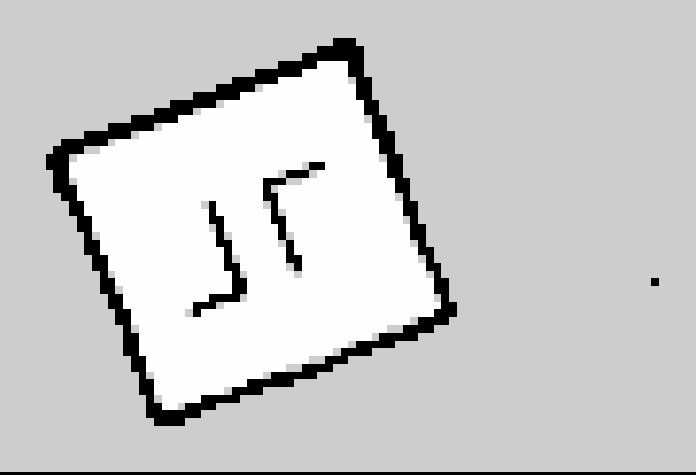

# Mapeamento
Para garantir a autonomia na circulação do robô nos ambientes necessários, desenvolvemos uma estrutura avançada de mapeamento usando ROS2 para integrar Cartographer, Nav2 e RViz. Essa abordagem permite ao robô identificar obstáculos por meio do Lidar, que emite pulsos de laser para criar e atualizar um mapa tridimensional em tempo real. A comunicação eficiente entre esses componentes, facilitada pelo ROS2, proporciona uma solução integrada para a navegação autônoma, permitindo ao robô desviar de obstáculos com precisão.

Essa integração sinérgica não só utiliza o Nav2 para planejar trajetórias otimizadas com base nos dados do Cartographer, mas também utiliza o RViz para a visualização em tempo real do ambiente mapeado. Essa abordagem não apenas aprimora a capacidade de detecção de obstáculos do robô, mas também oferece uma interface visual intuitiva para monitorar e depurar o desempenho durante suas operações autônomas.

#### Nav2 (Navigation2):
O Nav2 é um sistema de navegação autônoma construído no ROS2. Ele planeja trajetórias para robôs, usando dados de sensores e informações de mapeamento para evitar obstáculos e alcançar destinos de maneira eficiente.

#### RViz (ROS Visualization):
O RViz é uma ferramenta de visualização 3D no ROS, permitindo aos desenvolvedores visualizar em tempo real dados de sensores e o estado do robô. Essa interface gráfica é essencial para desenvolvimento e depuração.

#### Cartographer:
O Cartographer é um sistema de mapeamento simultâneo e localização (SLAM) no ROS, usando dados de sensores, como Lidar, para criar mapas 3D em tempo real. Esses mapas são fundamentais para o planejamento de trajetórias e a navegação autônoma de robôs.

### Sistema de Mapeamento com ROS2 

Para iniciar o processo de mapeamento, inicializamos o Turtlebot acionando o "bringup" inicial.

```
ros2 launch turtlebot3_bringup robot.launch.py 
```


Posteriormente, utilizamos o Cartographer, uma ferramenta de mapeamento que, ao ser acionada, inicializa o Nav2. Os passos a seguir fornecem os comandos necessários:
```
#Iniciando o Mapeamento
ros2 launch turtlebot3_cartographer cartographer.launch.py use_sim_time:=True 

#Salvando o Mapa
ros2 run nav2_map_server map_saver_cli -f c2-papel
```

Para podermos simular o controle do robô em um mapa projetado com o cartgrapher, utilizamos a pista base que nos gerou o seguinte mapeamento: 



### Demonstração de Mapeamento 

<iframe width="560" height="315" src="https://www.youtube.com/embed/bXuKDN5mV2c?si=4wi5TK8Lz53Wfjm7" title="YouTube video player" frameborder="0" allow="accelerometer; autoplay; clipboard-write; encrypted-media; gyroscope; picture-in-picture; web-share" allowfullscreen></iframe>