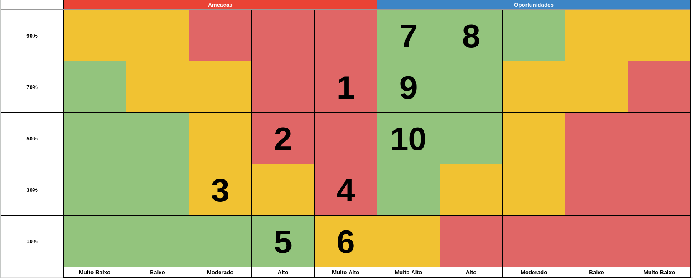

# Matriz de Riscos

**1. Existir produtos mais baratos com o mesmo objetivo**: Baratear o projeto continuando com peças de alta qualidade, removendo elementos externos desnecessários

**2. Falta de conectividade com a internet(necessário para o seu funcionamento)**: Armazenamento de informações já registradas localmente até ser reconectado na rede e ficando inoperante caso não esteja realizando nenhuma ação a fim de evitar problemas de funcionamento.

**3. Manutenção necessária de componentes pelo seu desgaste ou mal comportamento**: O robô sinalizar caso necessite de manutenção através do LCD ou outra forma(chatbot, barulhos e afins)

**4. Sistema de mapeamento do robô não funcionar como deveria**: Otimizar funções e definir padrões de qualidade a fim de criar um sistema mais conciso

**5. Robô não reconhecer com exatidão os comandos realizados por voz**: Criar um padrão de qualidade para que o aúdio seja aceito e utilizar bibliotecas de manipulação de aúdio para eliminar ruidos e afins antes de enviar para processamento.

**6. Baixa aceitação do mercado pela atribuição de técnologias sem atual utilização conjunta**: Demonstrar a importância da junção dessas tecnologias em questões de acessibilidade e a facilitação de tarefas e entendimento necessário.

**7. Inovação com atribuição de um chatbot**: A atribuição de um chatbot promove a acessibilidade a pessoas com dificuldade para se expressar, além de possuir TTS(Text To Speech) e STT(Speech To Text) em junção ao chat para pessoas cegas.

**8. Aceitação no mercado por atribuição de novos elementos a solução já existente**: Atribuição do projeto por parte da AMBEV e outras empresas, buscando transformar o sistema em escala indústrial

**9. Facilidade para os operadores em seu trabalho, otimizando o tempo**: Diminuição do estresse por parte dos operadores, otimização do tempo e disponibilizando realocação de grande parte dos operadores responsáveis para outras tarefas mais essênciais

**10. Facilidade de uso pelo entendimento de linguagem natural ao seestaduais e internacionais) comunicar com o chatbot**: Acessibilidade para pessoas cegas ao utilizar TTS(Text To Speech), STT(Speech To Text) e diminuição de barreiras linguísticas(por questões de linguagem e girias de cada localidade).

Dessa forma, é possível observar que a matriz de riscos revela uma série de desafios e oportunidades. Por um lado, os riscos, como a concorrência de produtos mais baratos e a falta de conectividade com a internet, exigirão uma estratégia de manutenção e inovação contínua. No entanto, ao abordar esses desafios com a otimização do projeto, o uso de tecnologias como chatbots e a promoção da acessibilidade, o projeto tem o potencial de conquistar a aceitação do mercado e transformar as operações em diversos setores industriais. A capacidade de facilitar o trabalho dos operadores e melhorar a comunicação através de linguagem natural reforça a relevância desse projeto. Em resumo, enfrentando os riscos com estratégias sólidas e capitalizando as vantagens, o projeto do robô para a AMBEV promete trazer benefícios significativos tanto para a eficiência operacional quanto para a inclusão de pessoas com diferentes necessidades.